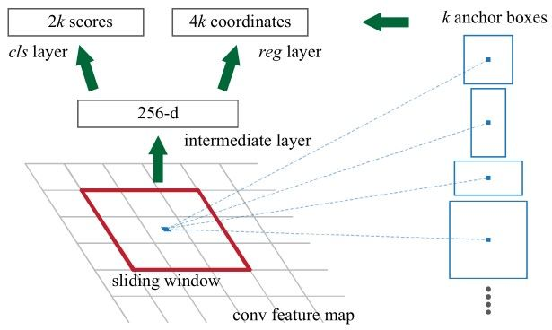
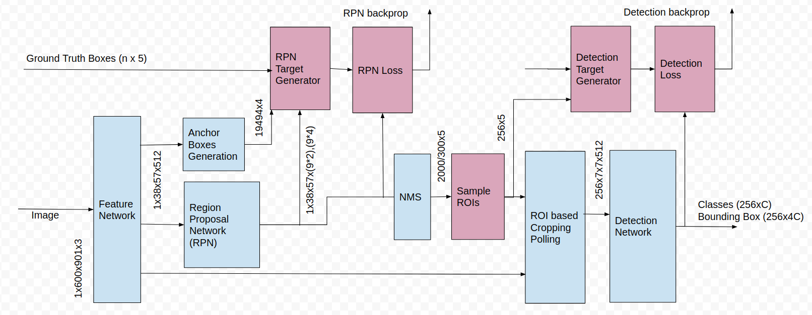

# Implementation of Faster RCNN in Tensorflow

## TODO

Create training and evaluation pipeline

<!-- In colab notebook you can download and extract PASCAL VOC 2007 dataset by running following code :

```bash
# Downloading training and validation dataset...
!wget http://pjreddie.com/media/files/VOCtrainval_06-Nov-2007.tar
!wget http://pjreddie.com/media/files/VOCtest_06-Nov-2007.tar
!wget http://pjreddie.com/media/files/VOCdevkit_08-Jun-2007.tar

# Extracting...
!tar xf VOCtrainval_06-Nov-2007.tar
!tar xf VOCtest_06-Nov-2007.tar
!tar xf VOCdevkit_08-Jun-2007.tar
```

## Usage

```bash
python3 train.py
```

> **_NOTE:_** on Colab Notebook use following command:

```python
!git clone <link-to-repo>
%matplotlib inline
%run train.py
``` -->

## Contributed by

* [Padam Sharma](https://github.com/PadamSharma)

## References

* **Title**: Faster R-CNN: Towards Real-Time Object
                          Detection with Region Proposal Networks
* **Authors**: Shaoqing Ren, Kaiming He, Ross Girshick, and Jian Sun
* **Link**: <https://arxiv.org/abs/1506.01497>
* **Tags**: Convolution • Faster R-CNN • Fast R-CNN • RoIPool • RPN • Softmax • VGG-16
* **Year**: 2016

# Summary

## Introduction

Faster-RCNN is one of the most well known object detection neural networks. It is also the basis for many derived networks for segmentation, 3D object detection, fusion of LIDAR point cloud with image ,etc.

Basically Faster RCNN is composed of 3 neural networks —

1. Feature Network that generates features from images.
2. Region Proposal Network ( RPN ) that generate a number of region proposals or bounding boxes called Region of Interests ( ROIs) that has high probability of containing any object
3. Detection Network takes input from both the Feature Network and RPN , and generates the final class and bounding box.

Also, the feature network and the detection network is similar to that of Fast RCNN, thus architecture of Faster R-CNN can be said to consist of RPN and Fast RCNN.


## Drawbacks of Fast RCNN and need for a better model

* As the name of the paper suggests that for real time object detection we need a model which can produce results more quickly ,while Fast RCNN uses selective search as a proposal method to find the Regions of Interest, which is a slow and time consuming process.

* Fast RCNN takes around 2 seconds per image to detect objects thus it is not feasible for real-time object detection task.

* While on the other hand, Faster RCNN benefits from its RPN which takes effective 10ms to generate region proposals. Thus it takes overall 0.2s to generate prediction per image.

## Key Features of Faster RCNN

### 1-Region Proposal Network (RPN)

   This paper proposed a network called region proposal network (RPN) that can produce the region proposals. This has some advantages over the Selective Search Algorithm of Fast RCNN:

   1. The region proposals are now generated using a network that could be trained and customized according to the detection task.
   2. As the proposals are generated using a network, they can be trained end-to-end for customized detection task. Hence, it produces better region proposals compared to generic methods like Selective Search and EdgeBoxes.
   3. The RPN processes the image using the same convolutional layers used in the Fast R-CNN detection network. Thus, the RPN does not take extra time to produce the proposals compared to the algorithms like Selective Search.
   4. Due to sharing the same convolutional layers, the RPN and the Fast R-CNN can be merged/unified into a single network. Thus, training is done only once.

The RPN works on the output feature map returned from the last convolutional layer shared with the Fast R-CNN. This is shown in the next figure. Based on a rectangular window of size nxn, a sliding window passes through the feature map. For each window, several candidate region proposals are generated. These proposals are not the final proposals as they will be filtered based on their "objectness score".

### 2-Concept of Anchor Boxes

The feature map of the last shared convolution layer is passed through a rectangular sliding window of size nxn, where n=3 for the VGG-16 net. For each window, K region proposals are generated. Each proposal is parametrized according to a reference box which is called an anchor box. The parameters of the anchor boxes are scale & aspect ratio.

Generally, there are 3 scales and 3 aspect ratios and thus there is a total of K=9 anchor boxes. But K may be different than 9. In other words, K regions are produced from each region proposal, where each of the K regions varies in either the scale or the aspect ratio.  Some of the anchor variations are shown in the next figure.



### 3-Objectness Score

The cls layer outputs a vector of 2 elements for each region proposal. If the first element is 1 and the second element is 0, then the region proposal is classified as background. If the second element is 1 and the first element is 0, then the region represents an object.

For training the RPN, each anchor is given a positive or negative objectness score based on the Intersection-over-Union (IoU).

The IoU is the ratio between the area of intersection between the anchor box and the ground-truth box to the area of union of the 2 boxes and ranges from 0.0 to 1.0. When there is no intersection, it is 0.0. As the 2 boxes get closer to each other, it increases until reaching 1.0 (when the 2 boxes are 100% identical).

The given 4 conditions use the IoU to determine whether a positive or a negative objectness score is assigned to an anchor:

1. An anchor that has an IoU overlap higher than 0.7 with any ground-truth box is given a positive objectness label.
2. If there is no anchor with an IoU overlap higher than 0.7, then assign a positive label to the anchor(s) with the highest IoU overlap with a ground-truth box.
3. A negative objectness score is assigned to a non-positive anchor when the IoU overlap for all ground-truth boxes is less than 0.3. A negative objectness score means the anchor is classified as background.
4. Anchors that are neither positive nor negative do not contribute to the training objective.

### 4-Feature Sharing between RPN and Fast R-CNN

The 2 modules in the Fast R-CNN architecture, namely the RPN and Fast R-CNN, are independent networks. Each of them can be trained separately. In contrast, for Faster R-CNN it is possible to build a unified network in which the RPN and Fast R-CNN are trained at once.

The core idea is that both the RPN and Fast R-CNN share the same convolutional layers. These layers exist only once but are used in the 2 networks. It is possible to call it layer sharing or feature sharing. Remember that the anchors [3]
are what makes it possible to share the features/layers between the 2 modules in the Faster R-CNN.

**NOTE**: The following figure contains the detailed architecture of the model



<!-- # Results

## Test images after 5 epochs(VOC 2007)


## Accuracy and speed of Model(VOC 2007)

 -->
